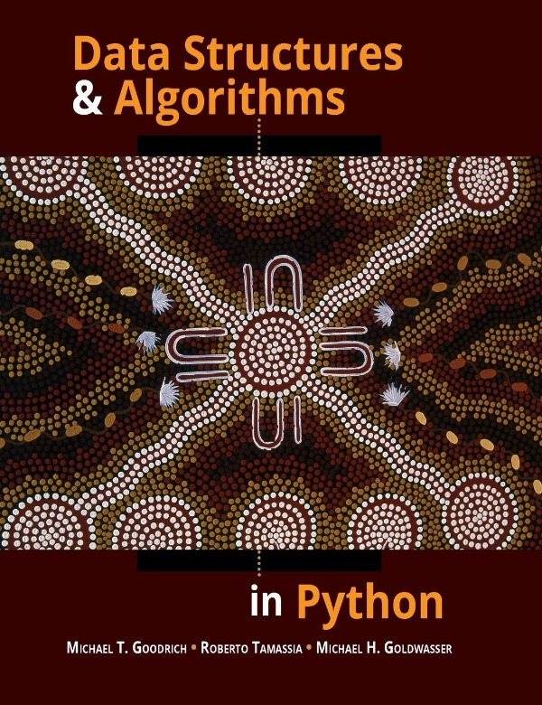
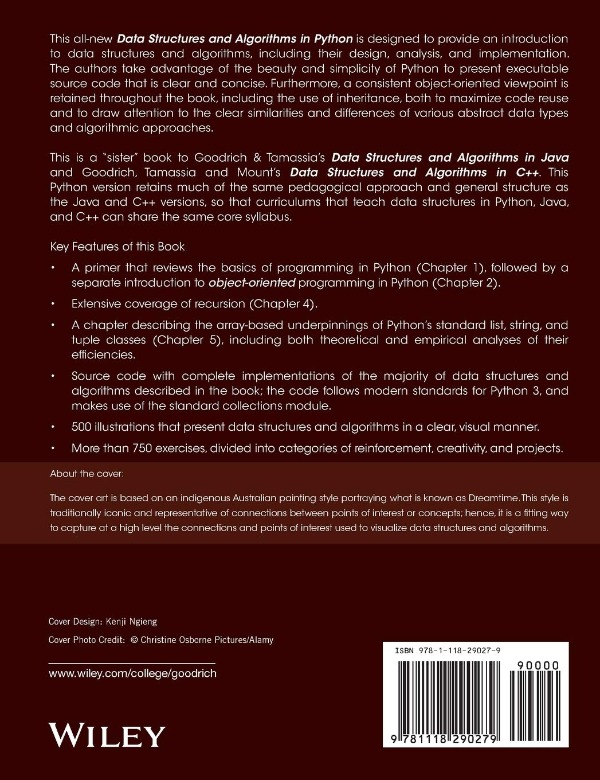

# Data Structures and Algorithms in Python

## Solutions of Data Structures and Algorithms in Python

Data Structures and Algorithms in Python is a book written by Michael T. Goodrich, Roberto Tamassia, Michael H. Goldwasser

In this repo you will find the solutions of the exercises in the book mentioned above....

Everyone are welcomed to fork the repo and contirbute to the repo.....

If you like our work please star the repo⭐️
